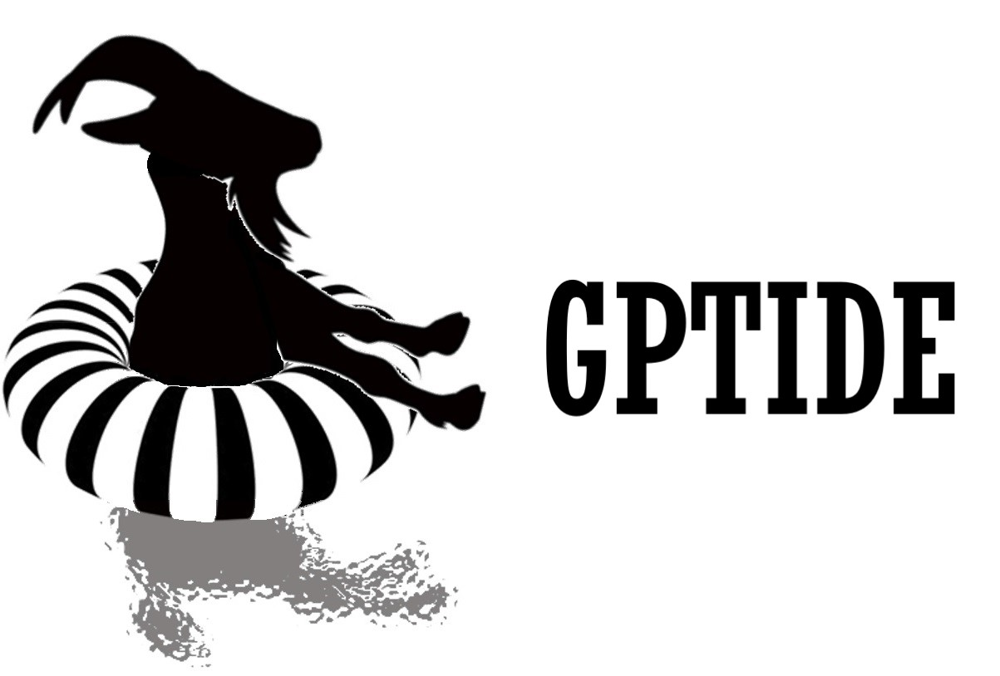

.. gptide documentation master file, created by
   sphinx-quickstart on Thu Jul 21 20:33:05 2022.
   You can adapt this file completely to your liking, but it should at least
   contain the root `toctree` directive.

gptide: a lightweight module for Gaussian Process regression
=============================================================

Gaussian Process regression toolkit for Transformation of Infrastructure through Digitial Engineering applications.

Gaussian Process regression (also called *Optimal Interpolation* or *Kriging*) is useful for fitting a continuous surface to sparse observations, i.e. making predictions. Its main use in environmental sciences, like oceanography, is for spatio-temporal modelling. This package provides a fairly simple API for making predictions AND for estimating kernel hyper-parameters. The hyper-parameter estimation has two main functions: one for Bayesians, one for frequentists. You choose.

Note that there are many other Gaussian Process packages on the world wide web - this package is yet another one. The selling point of this package is that the object is fairly straightforward and the kernel building is all done with functions, not abstract classes. The intention is to use this package as both a teaching and research tool.

Source code: https://github.com/tide-itrh/gptide

Contents
--------

.. toctree::
   :maxdepth: 1

   examples
   api
   whatsnew

